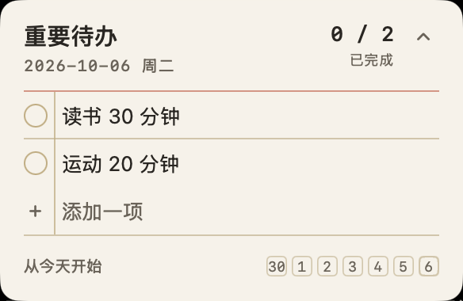
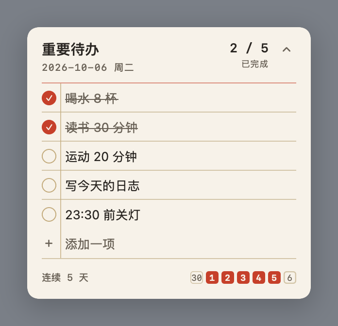
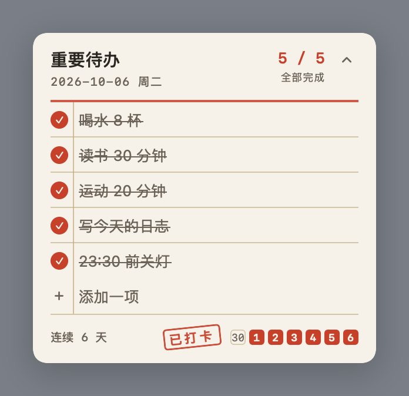
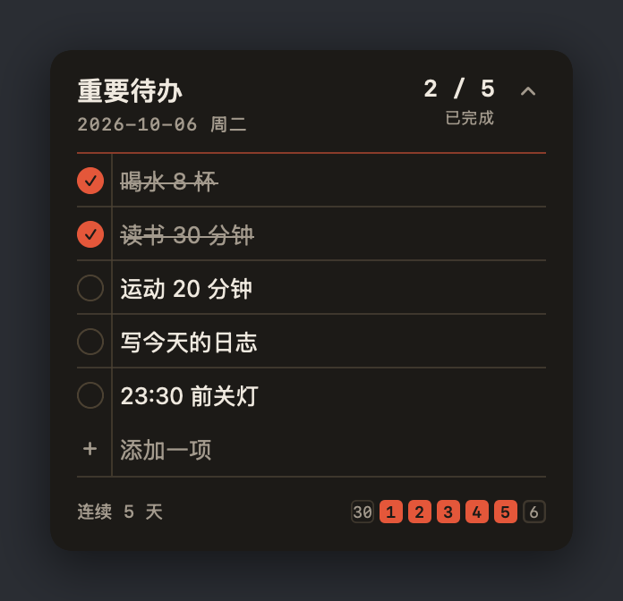

# 重要待办

贴在 macOS 桌面上的一张每日待办小卡：今天要做的事一行一件，做完给它打一个孔，全部打完，卡片上盖一枚「已打卡」印章。

用原生 Swift + SwiftUI 写的，只用系统自带的 Command Line Tools 编译，**不需要完整 Xcode，也没有任何第三方依赖**。纯本地、不联网、不要账号，数据就是一个 JSON 文件。



<sub>上图是运行中的实机截屏。下面是代码渲染的各个状态：</sub>

| 进行中 | 已打卡 | 深色模式 |
|---|---|---|
|  |  |  |

## 它能做什么

- **每日清单**：任务每天自动翻新，昨天的孔位不会带到今天
- **点一下就打卡**：打孔动效 + 触控板轻震；再点一下取消
- **连续天数**：卡片底部一排小方格是最近 7 天，做完的那天盖红色日期戳
- **全部完成**：标题横线加粗，右下角盖一枚「已打卡」印章
- **改任务**：鼠标悬停在任务行上，右侧出现铅笔（改标题）和 ×（不再做这一项）；点「＋ 添加一项」写新任务
- **随时收起**：卡片右上角 ⌃ 按钮 / 全局快捷键 ⌥⌘T / 菜单栏图标 / Esc
- **随时叫回**：⌥⌘T / 菜单栏图标 / 聚焦搜索 / Finder 双击（已在运行时不会开第二份）
- **窗口**：可拖动并记住位置；可选浮在最前或贴到桌面层；跟随系统浅色/深色
- **开机自启**（可选）：登录后只在菜单栏待命，不往桌面丢卡片

## 要求

- macOS 13 或更新
- Apple Silicon（用 Intel 机器的话，改 `build.sh` 里的 `TARGET` 即可）
- 已安装 Command Line Tools（`xcode-select --install`，一般早就有）

## 构建与安装

```bash
./build.sh              # 编译出 build/重要待办.app
./build.sh --run        # 编译并启动
./build.sh --preview    # 渲染界面到 preview/*.png（不用开窗口就能看样式）
./build.sh --test       # 跑逻辑自检（打卡 / 连续天数 / 跨天 / 存档恢复）
./install.sh            # 装到 ~/Applications（旧版本自动移到废纸篓，可恢复）
```

装好后用 Spotlight 输入「重要待办」，或者：

```bash
open ~/Applications/重要待办.app
```

> 别用 `cp -R build/重要待办.app ~/Applications/` 覆盖已有版本：目标存在时它会把新包塞进旧包里面，App 看起来还在、跑的却是旧代码。`install.sh` 就是为这个写的。

## 用法

| 操作 | 结果 |
|---|---|
| 点任务一行 | 打卡 / 取消打卡 |
| 悬停任务行 | 出现铅笔（改标题）和 ×（删掉这一项） |
| 点「＋ 添加一项」 | 写新任务，回车继续加下一条 |
| 拖动卡片空白处 | 移动卡片，位置会被记住 |
| 卡片右上角 ⌃ | 收起卡片 |
| **⌥⌘T（全局）** | 呼出 / 收起卡片 |
| 菜单栏 ✓ 图标 左键 / 右键 | 显示隐藏 / 菜单（移回右上角、窗口层级、开机自启、打开数据文件、清空今天、退出） |
| Esc（卡片为当前窗口时） | 收起卡片；正在输入时先取消输入 |
| 跨过 0 点 | 孔位自动清空，昨天的记录进「最近 7 天」与连续天数 |

### 关于 ⌥⌘T

用的是 Carbon `RegisterEventHotKey`：后台 App 靠它拿全局快捷键**不需要辅助功能权限**，不会弹任何系统授权框。代价是组合键被全局独占——⌥⌘T 在 macOS 上是好几个 App 的「显示/隐藏工具栏」，在那些 App 里按它会只呼出卡片。想换组合键，改 `Sources/HotKey.swift` 里的 `CardShortcut` 一处即可。

如果按 ⌥⌘T 没反应，通常是已经有别的 App 全局占用了这个组合（这一点无法从程序里探测），换个组合即可。

### 菜单栏图标看不见？

iBar / Bartender / Hidden Bar 这类菜单栏管理工具会把「多余的」图标挪到屏幕外收起来，本 App 的图标可能就在隐藏区里。两种办法：在那些工具的界面里把它拖出来；或者干脆不用它——⌥⌘T 和卡片上的 ⌃ 按钮都不依赖菜单栏图标。

## 数据

`~/Library/Application Support/DailyCheck/data.json`

```json
{
  "todos":   [ { "id": "...", "title": "读书 30 分钟" } ],
  "log":     { "2026-10-06": ["id1", "id2"] },
  "needed":  { "2026-10-06": ["id1", "id2", "id3"] },
  "floating": true,
  "frameX": 1156,
  "frameY": 680
}
```

- `log` 是每天实际打过的孔，`needed` 是那一天的「应打孔清单」。分开存是为了：**今天新加一条任务，不会把昨天已完成的记录变成未完成**（否则连续天数会被自己的编辑弄乱）。
- 备份就是复制这个文件；想从头开始就退出 App 删掉它。
- 首次打开有三条占位任务，删掉换成自己的即可。

## 已知限制

- 只支持每日重复，没有「每周三次」这类规则
- 没有通知提醒（ad-hoc 签名下弹通知受限）
- 窗口层级只有两种：浮在最前 / 贴桌面层

## 源码结构

| 文件 | 作用 |
|---|---|
| `Sources/main.swift` | 启动与装配，`--start-hidden` / `--verify` |
| `Sources/Store.swift` | 数据模型：任务、每日打孔记录、连续天数、JSON 读写 |
| `Sources/Theme.swift` | 全部颜色与字体（浅色/深色），设计契约写在文件顶部 |
| `Sources/WidgetView.swift` | 卡片界面（索引卡、孔位、印章、最近 7 天、收起按钮） |
| `Sources/Panel.swift` | 无边框浮层窗口：位置、层级、高度自适应 |
| `Sources/StatusBar.swift` | 菜单栏图标与菜单、开机自启（LaunchAgent） |
| `Sources/HotKey.swift` | 全局快捷键（Carbon） |
| `Sources/Preview.swift` | 把界面渲染成 PNG（只用于 `--preview`，不打包进 App） |
| `Sources/Tests.swift` | 逻辑自检（只用于 `--test`） |
| `DESIGN.md` | 设计记录：世界、色板、字体、尺寸、动效、窗口行为 |

## 为什么会有这个项目

想要一个「桌面上看得见、点一下就打勾、打完算今天过关」的东西，于是在 GitHub 上翻了一圈：高星的（AppFlowy、Joplin、Logseq、Super Productivity）都是完整应用，形态对得上的桌面小组件/菜单栏待办要么星标很少、要么早已停更。既然没有现成的，就用原生 Swift 写了一个小的。

## 许可

[MIT](LICENSE)
